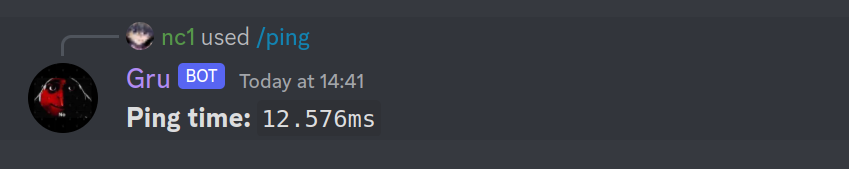

# Nova quickstart

This document illustrates the process of creating a Discord Bot using the 
Nova platform.

> Credentials should always be private.




# What you'll be doing

The example Bot executes `ping`s (ICMP Echo) requests using Application Commands,
also known as Slash Commands.

## Getting Started

### Configuring the Bot

Configuration is done by creating a file inside the [config](config/) directory.
The file should be named "default", we support TOML, JSON (and JSON5) and YAML.

Make sure to configure properly your instance before getting started, see the
example file in the directory for more information.

### Starting the Bot

You need to install Nova.
For simplicity we will use the [`all-on-one`](https://github.com/discordnova/Nova/tree/main/exes/all)
distribution, which provides a single binary. 
This is usesul in development environments.
Place the binary inside the [`bin`](bin/) directory, under the name `nova`.

> To get the most out of Nova, we strongly encourages you to deploy Nova 
correctly (as microservices), on the orchestrator you want (Kubernetes, 
Docker Compose...).
> The all-in-one distribution IS NOT MADE for production environments.

The next step is starting nova:

```bash
RUST_LOG=info ./bin/nova
```

### Installing Node Dependencies

This example uses Node.js and TypeScript.

You need to [Install Node.js](https://nodejs.org).
Then you simply run `npm install` to install the required dependencies.

### Registering Commands

Application Commands need to be registered to Discord ahead-of-run.
This usually is a one-time operation.
This step is thus optional if you already have registered the commands.

The `register.ts` utility does the job for you.

```bash
npm run register
```

### Starting the bot

To start the Bot and make it connect to the Nova Gateway, run the following:

```bash
# Using npm
npm run start
```

**Everything should be running now!**